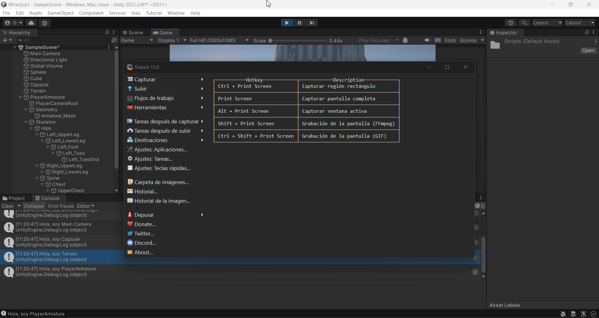

# Interfaces Inteligentes
## Práctica 1
### Ginés Cruz Chávez
Primera práctica de la asignatura Interfaces Inteligentes.

Para el montaje de esta escena se han seguido los siguientes pasos:
1. Se ha creado un nuevo proyecto 3D URP
2. Se han añadido objetos 3D básicos a la escena. (Cubo, esfera, cápsula)
3. Se ha añadido un terreno con pequeñas deformaciones, centrado con respecto al origen.
4. Se ha incluido el prefab PlayerArmature de Starter Assets Third Person
5. Se ha descargado el asset [Fast Food](https://assetstore.unity.com/packages/3d/props/food/fast-food-low-poly-3d-art-247217) de la Asset Store, y se ha incluido el prefab HotDog en la escena.
6. Se ha programado el script [DecirNombre.cs](DecirNombre.cs), que imprime el nombre y etiqueta del objeto al que se asocia.
